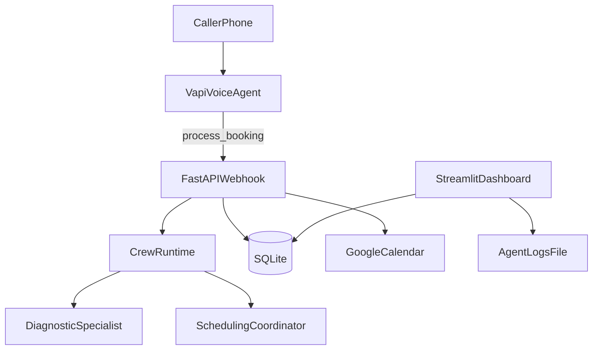
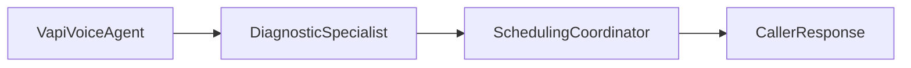

# Bulls Auto Repair Service Advisor

5-minute presentation + 2-minute QA guide.

## Slide 1 — Title and project goal

**Project:** Voice-enabled multi-agent auto repair service advisor  
**Goal:** Turn inbound phone calls into structured service bookings with estimate + calendar invite + manager visibility.

### Motivation
- Auto repair shops lose time and leads with manual call handling.
- Callers want fast answers and booking confirmation.
- Staff need a live view of active/recent requests.

---

## Slide 2 — Research problem and motivation

### Research/engineering problem
- How do we make voice booking reliable enough for real callers while still using agentic AI?
- How do we connect voice, reasoning, persistence, and scheduling without breaking real-time constraints?

### Why this matters
- Missed calls and delayed scheduling reduce conversion.
- Pure scripted IVRs are rigid; pure LLM flows can be unstable/slow.

---

## Slide 3 — State of the art / related work

- **Traditional call center scripts/IVR:** predictable but low flexibility.
- **Single-agent LLM voice assistants:** flexible, but often weak at deterministic actions and state tracking.
- **Agentic orchestration stacks (CrewAI/LangChain):** better role specialization, but need careful latency and tool design for production voice.

---

## Slide 4 — Limitations in existing approaches

- Hallucination risk for prices and availability.
- Tool-call retries/timeouts in real-time phone workflows.
- Weak operational visibility without logging + dashboarding.
- External integrations (calendar, DB) are brittle without deterministic handling.

---

## Slide 5 — Our system architecture

### Key design choice
- Keep **reasoning** agentic.
- Keep **side effects** (DB writes, calendar event creation) deterministic Python for reliability and speed.

---

## Slide 6 — Agents and task responsibilities

- **Vapi Voice Agent:** collects `customer_name`, `customer_email`, `vehicle`, `symptom`, `date`, `time`, calls backend, and reads final response naturally.
- **Diagnostic Specialist (CrewAI):** maps customer symptoms to likely service/estimate from service catalog.
- **Scheduling Coordinator (CrewAI):** generates appointment confirmation response using estimate + requested window.
- **Backend Integrations (non-LLM):** persist call/customer/booking rows and create Google Calendar invite.

---

## Slide 7 — Implementation and your contribution

### What was built
- FastAPI webhook interface for Vapi tool calls.
- Multi-agent backend with CrewAI role separation.
- SQLite CRM-like storage for customers/calls/bookings.
- Google OAuth + Calendar event integration.
- Streamlit manager dashboard (live logs + CRM tables).

### Your role / contribution (fill with your emphasis)
- Problem framing and user-flow design.
- Prompt engineering and Vapi tool workflow iteration.
- Integration testing and error-driven debugging.
- Performance/reliability trade-off decisions (agentic reasoning + deterministic side effects).

---

## Slide 8 — Evaluation results (from Vapi)

### Observed operational metrics (dashboard screenshots)
- End-to-end latency observed around **~1400 ms model latency** (varies by call/tool path).
- Runtime cost shown around **~$0.11/min** (depends on provider/model/settings).
- Successful end-to-end outcomes achieved:
  - voice intake
  - backend estimate
  - booking persistence
  - calendar invite sent
  - dashboard updates visible

### Model comparison
- **Llama 3.1 8B:** faster/cheaper but weaker reliability/efficiency for your workflow.
- **Claude Haiku 4.5:** better quality and response consistency for tool-using calls.

---

## Slide 9 — Challenges encountered and how we solved them

- **OAuth callback failure (`Missing code verifier`)**  
  Solved by persisting PKCE verifier/state between auth start and callback.

- **Webhook timeout and duplicate tool calls**  
  Solved by shortening critical path and moving DB/calendar side effects out of LLM agent chain.

- **Schema drift (phone removal)**  
  Solved by updating model/repositories/dashboard query + SQLite column cleanup.

---

## Slide 10 — Closing and future work

### Outcome
- Working multi-agent voice scheduling pipeline with live manager dashboard and real calendar integration.

### Future work
- More robust natural language date/time parsing (instead of demo fallback window).
- Better returning-customer personalization and profile memory.
- Production deployment with one public URL + monitoring/alerts.
- Expanded evaluation set (call success rate, average handle time, tool timeout rate).

---

## 2-minute QA prep (quick answers)

- **Is this still multi-agent?**  
  Yes. Voice collection is done by Vapi; reasoning is done by two CrewAI specialists.

- **Why not all-agent architecture?**  
  Deterministic DB/calendar side effects reduce latency and prevent call timeouts.

- **How is data stored?**  
  SQLite tables: `customers`, `calls`, `bookings`, `oauth_tokens`.

- **How do you prevent fabricated prices?**  
  Prompt/tool policy + estimate generation constrained by service catalog logic.
